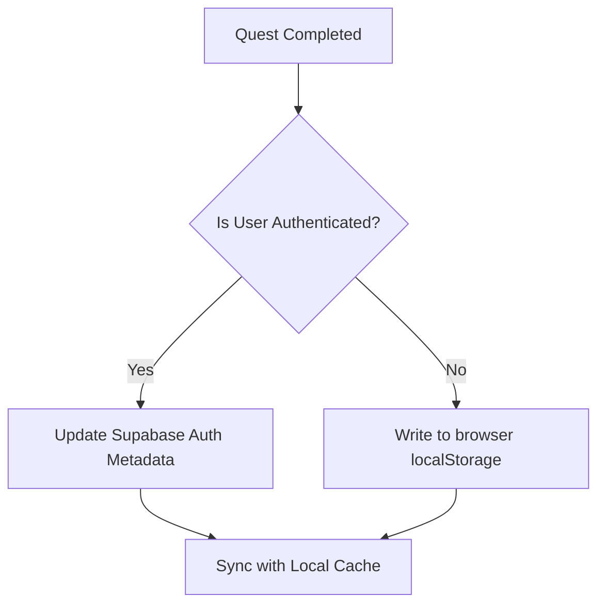

# Gamification & Reputation Documentation

Tagmate incentivizes neighborhood engagement through civic quest participation, reputation levels, and neighborhood contributor leaderboards.

---

## 🏆 Reputation Levels & Status Ranks
Every user accumulates contribution points referred to as **Reputation**. Status badges are assigned automatically based on point thresholds:

| Rank Badge | Reputation Range | Description |
| --- | --- | --- |
| `New` | 0 – 24 points | New neighbors exploring the area. |
| `Rising` | 25 – 49 points | Actively participating and building trust. |
| `Helpful` | 50 – 99 points | Recognized contributor with high response rates. |
| `Trusted` | 100+ points | Top community leaders and local champions. |

---

## 📝 Weekly Civic Quests
Quests are recurring checklist activities designed to encourage local actions. Completing a quest rewards the user with **+5 Reputation points**.

### Supported Quest Types
1. **Civic Love**: Triggered when a user likes another neighbor's post.
2. **Chatty Neighbor**: Triggered when a user comments on any tag thread.
3. **Active Citizen**: Triggered when a user votes on a question poll.
4. **Vocal Resident**: Triggered when a user submits a response RSVP to an event.

---

## 🔄 Synchronization & Storage Mechanics

To preserve user data across devices and sessions without requiring login, Tagmate utilizes a dual-layer synchronization model:

1. **Guest Fallback (`localStorage`)**:
   * Quest completion and current reputation points are saved locally in the browser's `localStorage` under `tagmate.completedQuests`.
2. **Authenticated Users (`Supabase Auth`)**:
   * Quest progress and reputation scores sync with `user_metadata` in Supabase Auth via `updateUserMetadata`.
   * On login, the local state merges with the metadata retrieved from the remote server, keeping quest checklists consistent across multiple browsers.

---

## 🥇 Top Contributors Leaderboard
Each neighborhood page features a contributors leaderboard tab:
* Ranks active neighbors based on post frequencies and total verified reputation metrics.
* Refreshed dynamically based on the active neighborhood boundaries and users.
