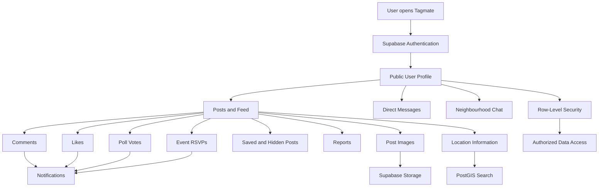
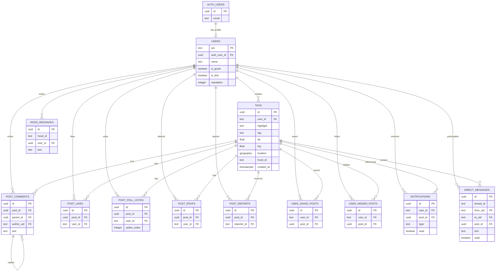

# Tagmate Database Architecture

## 1. System Overview

## 2. Database Entity Relationships

## Notes

- `public.tags` is the main posts table.
- `public.users` stores application profiles.
- `auth.users` stores Supabase authentication accounts.
- Post media is stored in the `tag-images` Storage bucket.
- PostGIS supports geographic post searches.
- Row-Level Security protects application data.